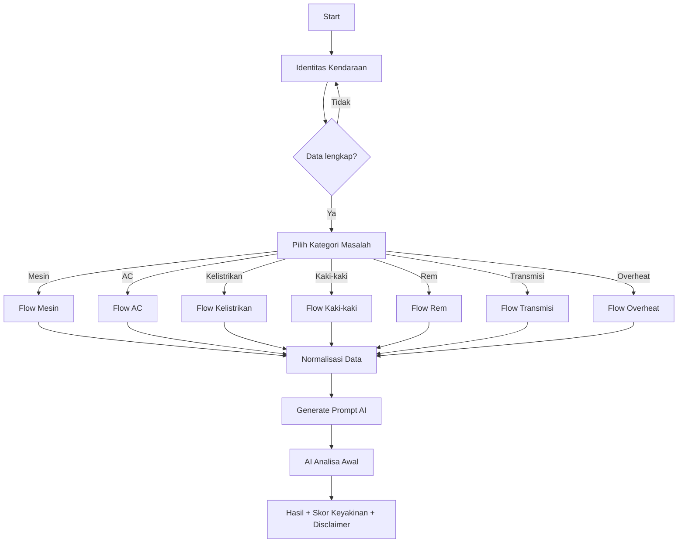
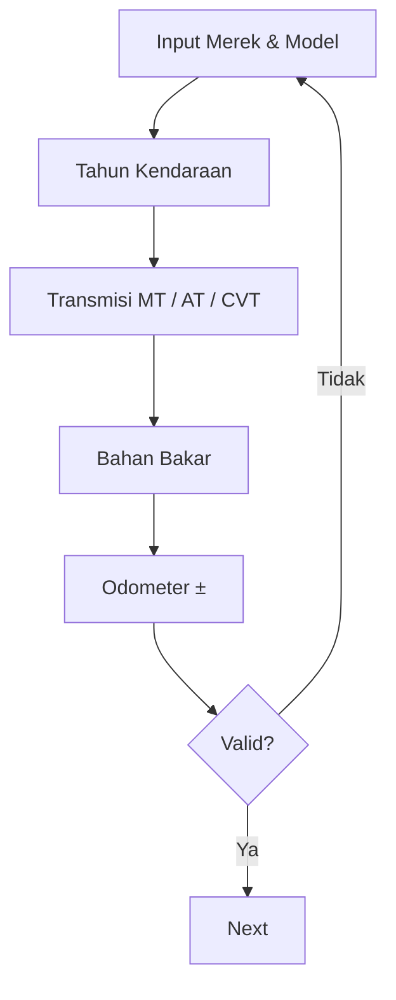
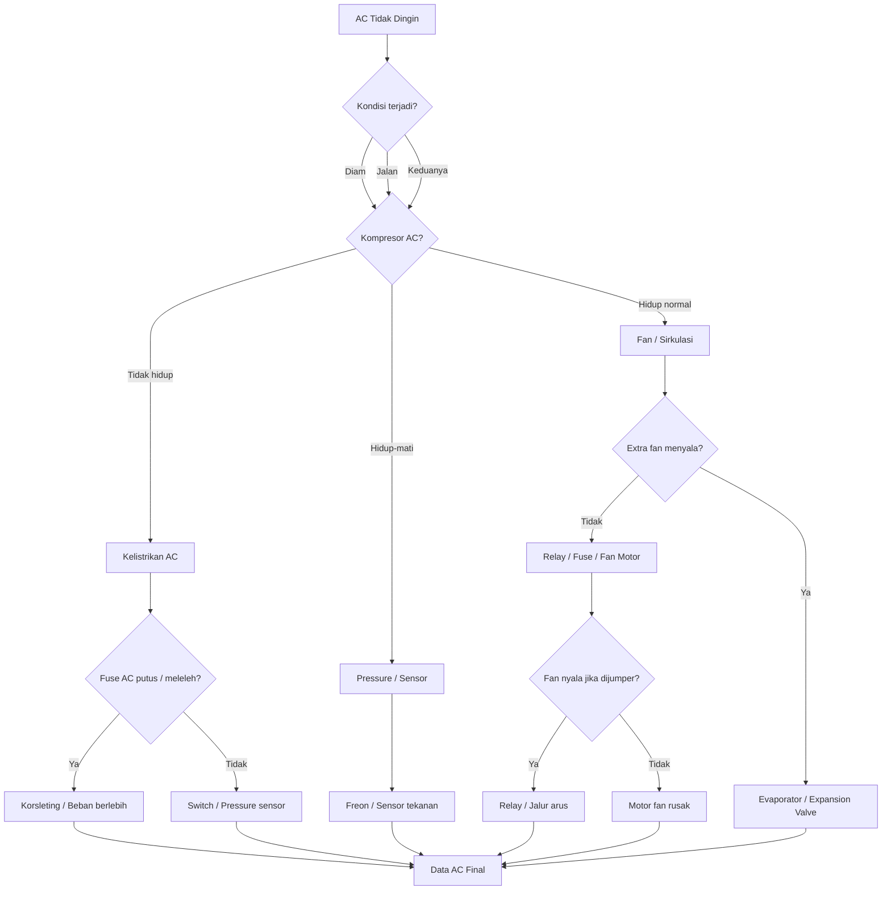
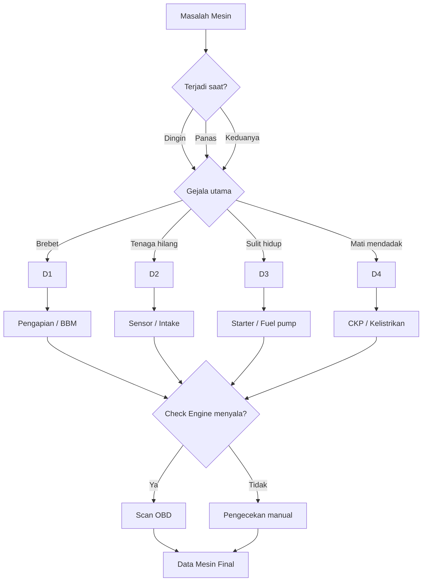
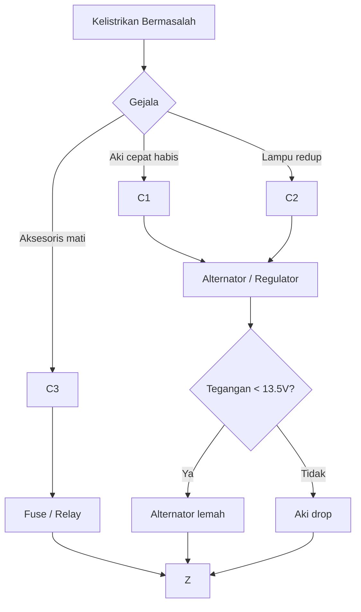
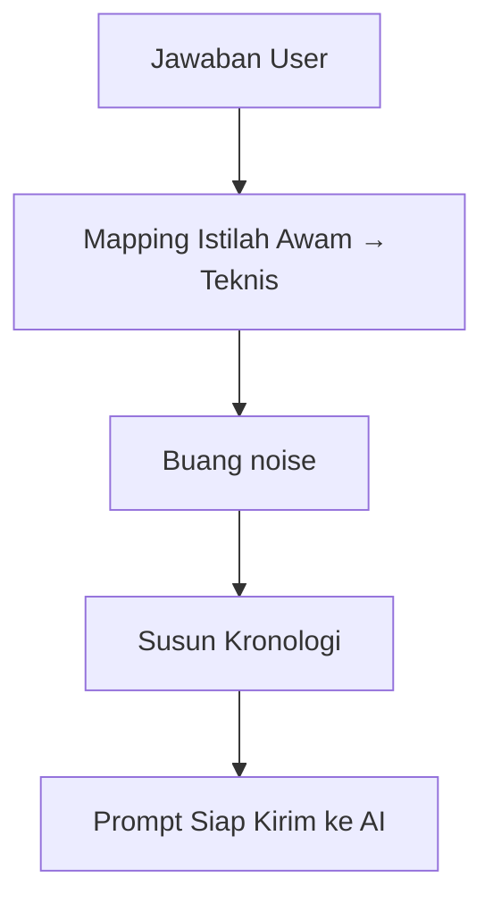
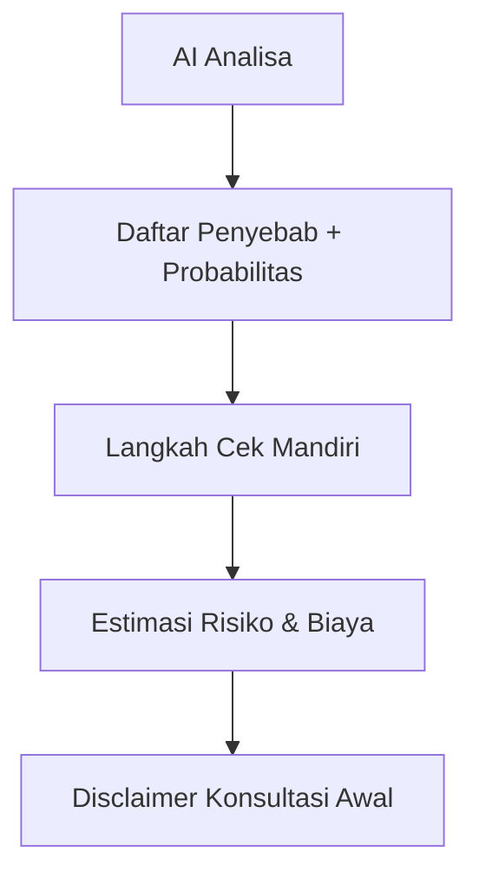

> ✅ Sudah mencakup: identitas mobil, kategori masalah, adaptive question, validasi, dan output ke AI.
> ✅ Data User disimpan di local storage, dan sewaktu-waktu bisa diedit untuk fine tuning.

---

## 1️⃣ OVERALL FLOW (GLOBAL)

---

## 2️⃣ IDENTITAS KENDARAAN (DETAIL)

---

## 3️⃣ FLOW MASALAH **AC** (Lengkap & Adaptif)

---

## 4️⃣ FLOW MASALAH **MESIN**

---

## 5️⃣ FLOW **KELISTRIKAN**

---

## 6️⃣ NORMALISASI DATA → AI PROMPT

---

## 7️⃣ OUTPUT KE USER

---

## 🔧 Catatan Penting (Best Practice)

- ❌ **Jangan langsung chat AI**
- ✅ AI **hanya dipakai di akhir**
- ✅ Flow = rule-based
- ✅ AI = reasoning & penjelasan

---
